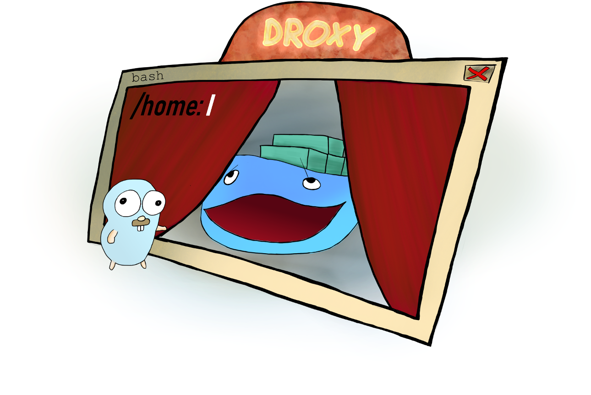

[](https://goreportcard.com/report/github.com/Oppodelldog/droxy)
[](https://raw.githubusercontent.com/Oppodelldog/droxy/master/LICENSE)
[](http://nulldog.de:12080/Oppodelldog/droxy)
[](https://ci.appveyor.com/project/Oppodelldog/droxy/branch/master)
[](https://codecov.io/gh/Oppodelldog/droxy)
# Droxy
> create commands that proxy to docker
  



## Getting started
If you have go installed on your machine simply get it.  
```go get github.com/Oppodelldog/droxy```  

Otherwise download a precompiled binary from [releases](https://github.com/Oppodelldog/droxy/releases).  

**Wiki**  
Take a look at the wiki examples to learn how to setup up custom commands  
[https://github.com/Oppodelldog/droxy/wiki](https://github.com/Oppodelldog/droxy/wiki)


## Configuration
In the config file, you define the commands you want to create.  
The config file must be named ```droxy.toml```.  

The following example contains all possible configuration options, you can leave out the most of them.  

> droxy.toml

```TOML
    Version="1"

    [[command]]
      name = "basic command"  # name of the command
      isTemplate = true       # this command can be used as a template, no command will be created
      addGroups = true        # add current systems groups  (linux only)
      impersonate = true      # use executing user and group for execution in the container (linux only)
      workDir = "/app"        # define working directory
      autoMountWorkDir=true   # if true and workDir exists on host it will be added to volume mounts
      removeContainer=true    # remove container after command has finished
      isInteractive=true      # enable interaction with the called command
      isDetached=false        # starts the container in background
      RequireEnvVars=false    # if true, not defined env vars that are configured will lead to an error
      uniqueNames=true
      mergeTemplateArrays = ["Volumes"] # in command config this will merge Volumes instead of overwriting them
      # volume mappings
      volumes = [
          "${HOME}:${HOME}",
          "${SSH_AUTH_SOCK}:/run/ssh.sock",
          "/etc/passwd:/etc/passwd:ro",
          "/etc/group:/etc/group:ro",
          "/run/docker.sock:/run/docker.sock"
      ]

      # environment variable mappings
      envvars = [
          "HOME=${HOME}",
          "SSH_AUTH_SOCK=/run/ssh.sock",
          "DOCKER_HOST=unix:///run/docker.sock"
      ]

      links = [
        "containerXY:aliasXY"
      ]

      ports = [
        "8080:80"
      ]

      portsFromParams = [
          "some regex where the group (\\d*) parses the port from",
      ]

    [[command]]
        template = "basic command"  # apply settings from template 'basic command' to this command
    	name = "php"                # name of the command which is created by calling 'docker-proxy symlinks'
    	entryPoint = "php"          # basic binary to execute inside the container
    	image = "php:7.1.13"        # docker image the container is run on

    [[command]]
        template = "basic command"
    	name = "phpstorm-php-unittest-integration"
    	entryPoint = "php"
    	image = "php:7.1.13"

    	# replace  127.0.0.1 with docker ip of host
        replaceArgs = [
            [
              "-dxdebug.remote_host=127.0.0.1",
              "-dxdebug.remote_host=172.17.0.1"
            ]
        ]

        # ensure xdebug will startup and communicate
        additionalArgs = ["-dxdebug.remote_autostart=1"]

```

## Create commands
Once you have setup your config, you want to create commands out of it.
To generate the command binaries, navigate next to droxy.toml file and execute
```bash
    droxy clones
```

By default ```droxy clones``` will not overwrite existing files.  
If you update droxy and want to update your commands as well, add flag ```-f``` which will overwrite existing files.

### creation options
There are three ways to create commands, 
* clones
* symlinks
* hardlinks

**Here are their pros and cons**

| subcommand | pro                                                               | con                                                                                                        |
|------------|-------------------------------------------------------------------|---------------------------------------------------------------------------------------------------------------|
| clones     | the command knows its directory, will find config next to command | takes more disk space                                                                                         |
| symlinks   | takes less disk space                                             | cannot determine the commands directory, you have to provide a config filepath by env var ```$DROXY_CONFIG``` |
| hardlinks  | takes less disk space and knows directory                         | harder to maintain                                                                                            |   

## Contribute
Feature requests and pull requests are welcome.

### How to

Ensure your environment sets ```export GO111MODULE=on``` since this uses go modules.  
On Linux or MacOS you might be interested in using **direnv**.
